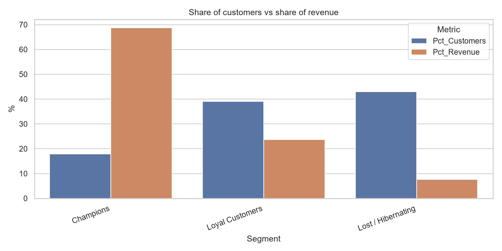
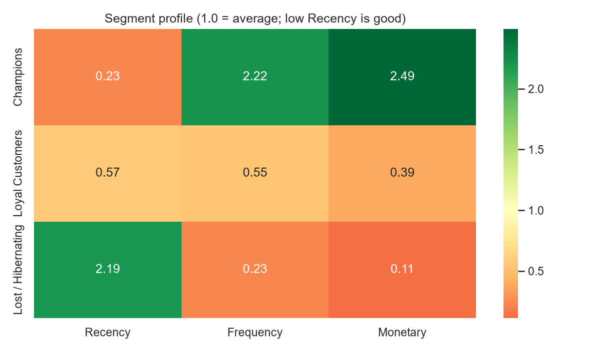
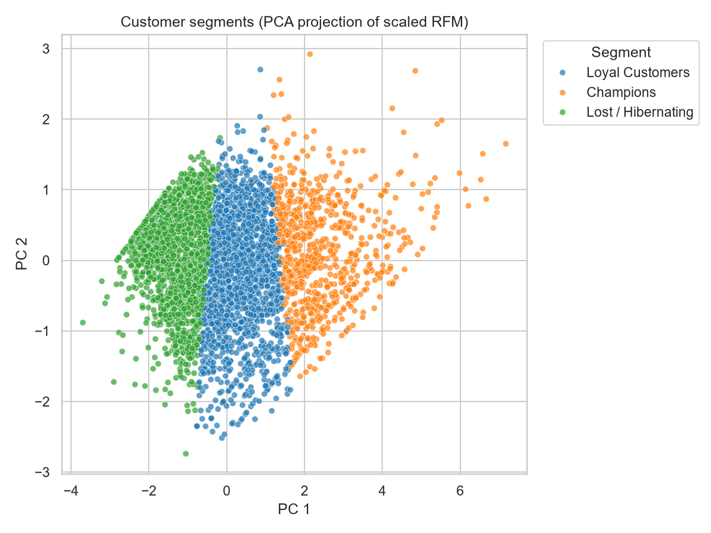
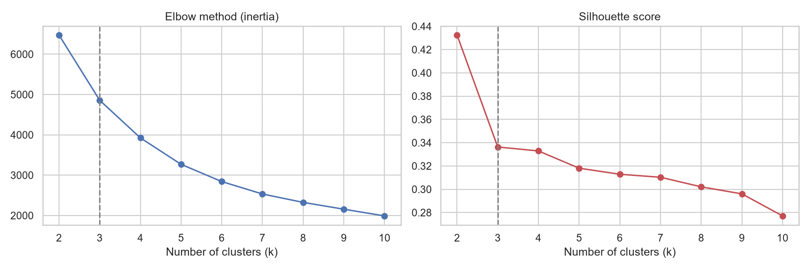

# Customer Segmentation with RFM Analysis and K-means

Segmenting 4,338 e-commerce customers by **Recency, Frequency and Monetary value (RFM)** with K-means clustering, then turning each segment into a concrete marketing action.

**Dataset:** [Online Retail (UCI)](https://archive.ics.uci.edu/dataset/352/online+retail), transactions from a UK-based online retailer, 1 Dec 2010 to 9 Dec 2011 (541,909 rows).

## Business question

Which customers generate most of the revenue, which are drifting away, and what should the marketing team do about each group?

## Key findings

- **18% of customers generate 69% of revenue.** 775 "Champions" (about 18 days since last order, 13 orders on average) account for £6.1M of the £8.9M total.
- **43% of customers are dormant and worth under 8% of revenue.** They last bought about 169 days ago and ordered 1.4 times on average, so only low-cost reactivation makes sense.
- **The middle group is the best upsell target.** 1,697 "Loyal Customers" (39% of customers, 24% of revenue) buy recently but only about 3 times on average.



## Segment summary

| Segment | Customers | % Customers | % Revenue | Avg recency (days) | Avg orders | Avg spend (£) |
|---|---|---|---|---|---|---|
| Champions | 775 | 17.9% | 68.7% | 18.0 | 13.3 | 7,880 |
| Loyal Customers | 1,697 | 39.1% | 23.7% | 44.0 | 3.3 | 1,240 |
| Lost / Hibernating | 1,866 | 43.0% | 7.6% | 168.9 | 1.4 | 363 |

### Recommended actions

| Segment | Action |
|---|---|
| Champions | Reward them: loyalty perks, early access to new products, ask for reviews and referrals. |
| Loyal Customers | Upsell and cross-sell; invite them into a loyalty programme to raise purchase frequency. |
| Lost / Hibernating | Low-cost reactivation only (for example one discount email); do not overspend. |





## Approach

1. **Clean** the transactions. Dropped rows without a CustomerID, cancellations (invoice starts with `C`), non-positive quantity or price, and duplicates. This kept 392,692 of 541,909 rows (72.5%).
2. **Engineer RFM features** per customer:
   - Recency: days since last purchase (relative to one day after the last transaction)
   - Frequency: number of distinct invoices
   - Monetary: total spend
3. **Preprocess** with a `log1p` transform (RFM is heavily right-skewed) followed by standardisation.
4. **Choose k** with the elbow method and silhouette score, restricted to k = 3-6 so the result stays actionable. The best silhouette score (0.336) was at k = 3.
5. **Fit K-means**, then name each cluster with transparent rules based on its centre (for example recent + frequent + high spend = *Champions*).
6. **Report** segment sizes, revenue share and a recommended action per segment.



## Project structure

```
.
├── main.py                 # run the full pipeline
├── src/
│   ├── data.py             # loading, cleaning, synthetic demo data
│   ├── rfm.py              # RFM features and quintile scores
│   ├── clustering.py       # scaling, k selection, K-means, segment naming
│   └── plots.py            # figures
├── tests/test_pipeline.py  # unit tests
├── data/                   # put the dataset here (see data/README.md)
└── outputs/                # generated tables and figures
```

## How to run

```bash
python -m venv .venv
.venv\Scripts\activate            # macOS/Linux: source .venv/bin/activate
python -m pip install -r requirements.txt

python main.py --data "data/Online Retail.xlsx"     # real data
python main.py --demo                               # synthetic data, no download
python main.py --data "data/Online Retail.xlsx" --k 4   # force the number of clusters
python -m pytest                                    # run tests
```

Outputs are written to `outputs/`: `customer_segments.csv`, `segment_summary.csv`, `k_selection_metrics.csv` and five figures in `outputs/figures/`. Download the dataset first (see `data/README.md`).

## Design decisions

- **Log transform before scaling.** Without it, a few very large customers dominate the distance calculation.
- **k restricted to 3-6.** k = 2 often has the best silhouette but only separates "good" from "bad" customers.
- **Rule-based segment names** keep the mapping from cluster to business label transparent and easy to audit.
- **Quintile RFM scores** (`R_score`, `F_score`, `M_score`) are also computed as an interpretable baseline to compare against the clusters.

## Limitations and next steps

- The silhouette score picked the smallest allowed k, so the segmentation is fairly coarse. Comparing k = 4 would split the large middle group further.
- Many customers in this dataset are wholesalers, which inflates average spend in the top segment. Comparing medians would be more robust.
- K-means assumes roughly spherical clusters; try Gaussian Mixture Models or hierarchical clustering to compare.
- Only about a year of data, so seasonality (a strong Q4 effect) may influence recency.
- Add a Streamlit app to explore segments interactively, and extend with customer lifetime value or churn prediction per segment.
